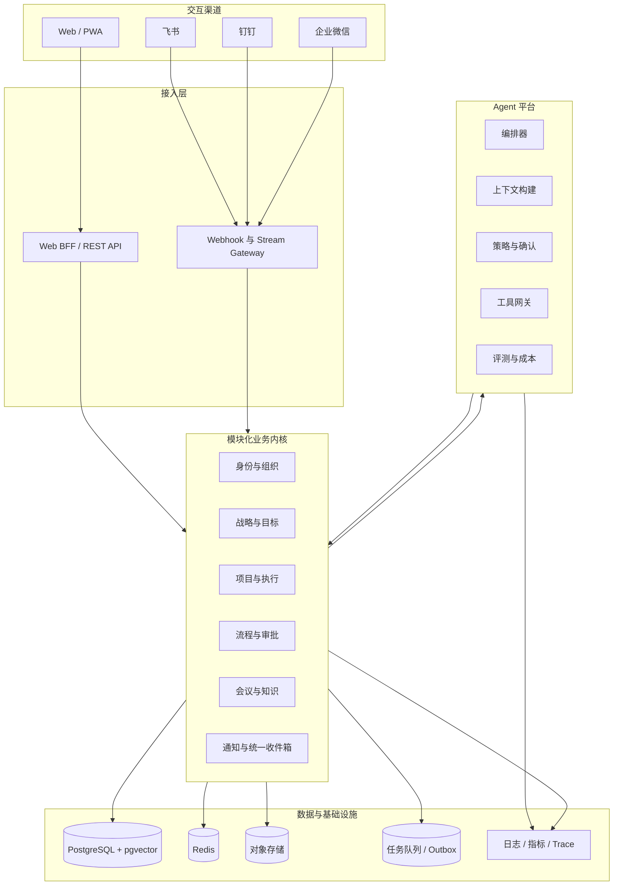

# 04 技术架构

## 1. 总体架构



## 2. 架构风格

- `AR-006` 首期使用模块化单体，不建立分布式事务负担。
- `AR-007` 模块通过应用服务和领域事件协作，不允许跨模块直接读写表。
- `AR-008` 外部平台调用统一通过 Integration Port，不在业务模块内引用平台 SDK。
- `AR-009` 长任务和外部写操作进入持久化 Job/Workflow，不阻塞 HTTP 请求。
- `AR-010` 所有外部写操作使用 Outbox、幂等键和重试预算。
- `AR-011` 浏览器只调用 BFF，不接触平台 Secret、模型 Key 或数据库。
- `AR-012` 自建桌面/移动平台未来复用 BFF 与领域服务，仅替换交互客户端。

## 3. 推荐代码结构

```text
src/
├── app/                     # Next.js 路由与页面
├── modules/
│   ├── identity/
│   ├── organization/
│   ├── strategy/
│   ├── delivery/
│   ├── governance/
│   ├── workflow/
│   ├── collaboration/
│   ├── knowledge/
│   ├── agent/
│   ├── integration/
│   └── audit/
│       ├── domain/
│       ├── application/
│       ├── infrastructure/
│       └── presentation/
├── platform/
│   ├── auth/
│   ├── database/
│   ├── queue/
│   ├── observability/
│   ├── secrets/
│   └── policies/
├── connectors/
│   ├── feishu/
│   ├── dingtalk/
│   └── wecom/
└── tests/
    ├── unit/
    ├── integration/
    ├── contract/
    ├── e2e/
    └── security/
```

## 4. 应用层组件

### 4.1 Web/PWA

- Next.js App Router、TypeScript、Server Components 与客户端交互组件。
- 响应式桌面和移动工作台。
- 服务端会话、CSRF 防护、无敏感数据持久化到浏览器存储。
- 离线仅缓存低敏感静态资源和用户明确选择的草稿。

### 4.2 BFF/API

- 会话解析、TenantContext、PolicyContext。
- REST 首期接口；内部领域事件不直接暴露。
- 输入 Schema 校验、统一错误格式、请求追踪 ID。
- 写请求支持 `Idempotency-Key`。

生产请求中的签名 Cookie 只携带不可篡改的身份线索，不作为持续授权凭据。BFF 在每次请求中使用 `tenant_id + actor_id` 从 PostgreSQL 重新解析用户状态、当前有效角色、权限和数据范围；授权源不可用或范围数据畸形时失败关闭。

### 4.3 持久化工作流

适用于：审批、Agent 确认、平台写回、组织同步、文档索引、定时管理节奏。

工作流节点记录输入摘要、策略版本、执行者、重试次数、输出引用和补偿动作。Agent 确认 HTTP 请求只创建持久化工具任务，实际副作用由独立 Worker 执行；领用、租约、未知结果和崩溃恢复遵循 [持久化执行设计](./16-durable-runtime.md)。

### 4.4 集成网关

- HTTP Webhook 入口和平台长连接 Worker 分离。
- 验签/解密后转为 UnifiedEvent，并完整持久化信封而非只保存 payload。
- ACK 与业务处理解耦。
- 连接器故障不影响核心网页只读能力。

## 5. 数据与一致性

- PostgreSQL 是核心事实源。
- Redis 仅用于可重建缓存、限流、锁和短期状态。
- 对象存储保存文档与附件，数据库保存元数据和权限。
- pgvector 首期与业务库同部署，但查询必须带 tenant 和 ACL 条件。
- Outbox 在业务事务内写入，异步 Dispatcher 通过事件 ID 与持久化发布回执幂等发布领域事件。
- Inbox 记录完整外部事件信封，通过原子租约、有限重试和死信保证至少一次投递下的幂等处理。
- 组织异动、项目变更、结项与补偿使用数据库事务和对象版本共同保证一致性；跨对象步骤不能拆成多个可独立成功的 HTTP 写入。

## 6. 部署拓扑

### 开发环境

- Web/API 单进程。
- Connector Worker 单进程，可只启用 Mock Provider。
- PostgreSQL、Redis、本地对象存储。

### 生产环境

- Web/API 无状态多副本。
- Inbox Worker、Agent Worker、Outbox Worker 和 Connector Worker 独立伸缩并上报版本化心跳。
- PostgreSQL 主备、Redis 高可用、版本化对象存储。
- 长连接 Worker 使用租约确保同一连接只被一个实例持有。
- 企业微信 Webhook 经 WAF/API Gateway 后进入专用接入服务。

## 7. 非功能指标

| 指标 | 首期目标 |
|---|---|
| Web API 可用性 | ≥ 99.9% |
| 普通读取 P95 | < 500ms |
| 普通写入 P95 | < 800ms，不含异步外部系统完成时间 |
| Webhook ACK | 飞书/钉钉/企业微信要求窗口内，内部目标 < 500ms |
| Agent 首 token | P95 < 4s |
| 同步最终一致 | 常规事件 < 60s |
| RPO/RTO | RPO ≤ 15min，RTO ≤ 2h |
| 审计完整率 | 100% |

## 8. 可观测性

每个用户请求、AgentRun、ToolCall、InboundEvent、WorkflowInstance 和外部 API 调用共享 trace_id。

监控包括：

- API 延迟、错误率、数据库连接和慢查询。
- 事件积压、重试、死信和幂等冲突。
- 平台 Token 刷新、限流、权限拒绝和回调验签失败。
- 模型延迟、token、成本、拒答、工具成功率和确认率。
- 权限策略拒绝、异常数据访问和高风险操作。

日志不得包含 Authorization、Secret、access_token、完整外部消息或敏感 Prompt。

## 9. 演进路线

只有满足以下条件才拆服务：模块团队独立、负载特征显著不同、部署节奏冲突或安全隔离需要。首选拆分顺序为 Connector Worker、Agent Worker、Knowledge Indexer，再考虑核心业务模块。
