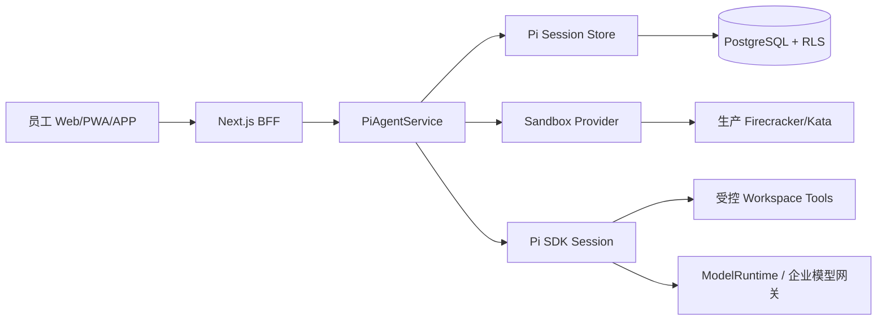

# Pi Agent 企业级统一开发 Runtime

本仓库现在包含 Pi Agent 的第一条受控运行链路：Next.js 控制面创建租户隔离的 Pi Session，Pi SDK 只加载平台注册的 Profile 和 Custom Tool，工具访问虚拟沙盒或明确拒绝的 Sandbox Provider，Session 事件和检查点通过内存存储或 PostgreSQL 存储。

## 当前边界



开发环境可以设置 `NEXUS_PI_SANDBOX_PROVIDER=virtual`，使用只存在于内存中的工作区验证 Vibe Coding 的文件读写、差异和事件链。该 Provider 不访问宿主机文件系统，也不执行命令。

生产环境不能使用 virtual Provider。未提供生产 Sandbox Provider 时，系统会返回 `PI_SANDBOX_PROVIDER_UNAVAILABLE`，不会回退到宿主机 Shell。当前仓库已经实现独立 `FirecrackerSandboxBackend`：它只启动受控的 Firecracker 进程，通过 Unix API Socket 配置微 VM，通过 cgroup v2 绑定 CPU/内存/PID 配额，并通过 vsock Guest Agent 执行文件和命令操作。恢复时还必须验证记录 PID 的 `/proc/<pid>/exe` 与配置 runtime 的 realpath 一致、limits 与 network policy 的编译 digest/字段一致，并且 PID 仍属于 `cgroup.procs`；销毁验证同时检查 runtime、API/vsock socket 和 cgroup 均无残留。Workspace mount 的 sourceRef 只允许 `workspace://`、`virtual://`、`forgejo://` 内部 opaque ref，Guest Agent read/list/write/patch 只接受相对路径并拒绝 `..`、反斜杠和超过 1.5 MB 文本。缺少 Linux、KVM/vhost-vsock、rootfs、kernel、cgroup 或 Guest Agent 时，Supervisor 继续返回 fail-closed；真实节点和攻击矩阵仍必须通过 G-027。Kata 仍保留为接口级 Provider，不因未实现而回退到容器。Next.js Web/API 进程不应直接运行 Pi CLI 或不受控的子进程。

## Pi 适配策略

- `DefaultResourceLoader` 被配置为关闭 Extensions、Skills、Prompt Templates、Themes 和 Context Files 发现，因此仓库内未知的 `.pi`、`.agents`、`AGENTS.md` 不会自动进入 Agent。
- Profile 决定工具 allowlist、网络策略、风险上限和所需企业权限。
- Skill/MCP 的实体和签名字段已在 `0024_pi_enterprise_runtime.sql` 建模；本阶段没有提供任意运行时安装入口。
- 模型网关通过 `ModelRuntime.registerProvider` 接入。API Key 只以 `$OPENAI_API_KEY`/`$LLM_API_KEY` 引用解析，不写入 Session、请求体或数据库。
- Pi 的会话树事件被写入 `pi_session_events`；客户端只使用服务端生成的 Session ID，租户和 Actor 从请求身份解析，不接受客户端覆盖。

## HTTP API

```text
POST /api/v1/pi/sessions
GET  /api/v1/pi/sessions
GET  /api/v1/pi/sessions/:id
POST /api/v1/pi/sessions/:id/messages
GET  /api/v1/pi/sessions/:id/events
POST /api/v1/pi/sessions/:id/interrupt
POST /api/v1/pi/sessions/:id/checkpoints
GET  /api/v1/pi/sessions/:id/checkpoints
GET  /api/v1/pi/sessions/:id/diff
```

消息接口返回 `202`，执行由服务端 Pi Runtime 启动；前端通过 SSE 读取 `pi-event`。真实生产部署还需要把该启动动作提交到独立 Runner 队列，并由 Runner 持有短期任务凭证。

## 生产配置最低要求

```text
DATABASE_URL=<managed PostgreSQL>
NEXUS_PI_SANDBOX_PROVIDER=firecracker|kata
NEXUS_PI_RUNNER_URL=<internal runner endpoint>
NEXUS_PI_SANDBOX_RUN_TOKEN_SECRET=<managed 32-byte-or-longer secret>
NEXUS_PI_SANDBOX_ROOTFS=<read-only prepared rootfs.ext4 image>
NEXUS_PI_SANDBOX_KERNEL_IMAGE=<approved Linux kernel image>
NEXUS_PI_FIRECRACKER_PATH=/usr/local/bin/firecracker
NEXUS_PI_SANDBOX_GUEST_AGENT_PORT=5000
NEXUS_PI_SANDBOX_GUEST_CID=3
NEXUS_PI_SANDBOX_SOCKET_DIRECTORY=/run/nexus/pi-sandbox
NEXUS_PI_CGROUP_ROOT=/sys/fs/cgroup/nexus-pi
NEXUS_PI_EGRESS_PROXY_ENDPOINT=<approved HTTPS egress proxy, optional when network policy is none>
NEXUS_MODEL_MODE=enabled
OPENAI_BASE_URL=<approved model gateway>
OPENAI_MODEL=<approved model id>
OPENAI_API_KEY=<secret injected by OpenBao/KMS, never committed>
```

默认网络策略为 `none`。任何出站代理、MCP Server、仓库 Forge 或对象存储访问都必须由 Runner 的 allowlist 和 Tool Gateway 批准，不能通过模型生成的 URL 直接出网。

远程 Sandbox Supervisor 的每个 `create/exec/io/destroy` 请求都必须携带由 Runner 服务端签发的短期 HMAC Run Token。Token 绑定 tenant、actor、session、workspace、run 和 provider，发送在 `Authorization` 请求头中，不进入 JSON body、数据库、审计正文或模型上下文；Supervisor 必须重新校验签名、有效期和 URL 对应的 Sandbox 绑定。缺少密钥、身份回显不一致或 Token 校验失败时，Provider 失败关闭。恢复路径只从持久化的 Sandbox 元数据重建句柄，不持久化明文 Token。

仓库提供独立 `pi-sandbox-supervisor` 入口和 Kubernetes 部署边界。它的 `/healthz` 只表示进程存活，`/readyz` 还要求托管 Token Secret、绑定目录、Firecracker 配置和后端运行时就绪；工厂只有在配置齐全时才选择 `FirecrackerSandboxBackend`，否则使用带原因码的 fail-closed 后端，不能把普通容器或虚拟 Provider 当作微 VM。Supervisor Service 的明文 HTTP 端口只允许由集群 mTLS/服务网格在 Runner 到 Supervisor 链路外层终止 TLS，Runner 的 `NEXUS_PI_SANDBOX_ENDPOINT` 仍必须是无凭据的 HTTPS 地址。

Firecracker 控制顺序固定为：创建专属运行目录和短 Unix Socket 路径，创建 cgroup，启动仅继承最小环境变量的 Firecracker 进程，将 PID 加入 cgroup，依次写入 `/machine-config`、`/boot-source`、`/drives/rootfs`、`/vsock`，按需由已审核的 Network Controller 配置网络，最后发送 `InstanceStart`。rootfs drive 强制只读；不配置 Network Controller 时只允许 `none` 网络策略。Guest Agent 使用 Firecracker vsock 的 `CONNECT <port>` / `OK <port>` 握手和单请求单响应 JSON Lines 协议，宿主机没有 `bash`、`docker` 或任意工作区路径执行入口。Guest Agent 必须随已批准的 rootfs 发布，当前仓库提供 host-side 客户端和协议校验，不把缺少 Guest Agent 的运行伪装成可用。

Supervisor 的运行元数据只保存 sandbox ID、Firecracker PID、Socket 路径、limits 和编译后的网络策略，不保存 Run Token 或企业 Secret。恢复时校验 Firecracker PID 的 `/proc` 命令行，并在重新打开原 cgroup 前确认该 PID 出现在目标 `cgroup.procs`，然后才恢复原配额；无法证明进程和 cgroup 身份时，恢复失败关闭并由 Runner 将 Run 标记为 `unknown`，不得清理未知进程。

在 Linux 微 VM 节点执行 `npm run pi-sandbox:preflight`。预检必须同时确认 Linux/架构、`/dev/kvm`、`/dev/vhost-vsock`、cgroup v2 的 cpu/memory/pids、Firecracker/Kata runtime、只读 rootfs image、kernel image、Guest Agent 端口、HTTPS Supervisor、短期 Token Secret；任何必需项失败都返回 `not_ready` 和非零退出码，不产生“容器可用”替代结论。当前 Windows/WSL2 开发环境没有 `/dev/kvm`，因此只能验证协议和失败关闭路径。

## 进入企业试点前的阻断 Gate

1. 在专用 Linux/KVM 节点部署当前 Firecracker backend、Guest Agent rootfs、kernel、cgroup 和 Network Controller，并验证 PID、Mount、网络、DNS、云元数据和 Docker Socket 隔离；当前 Windows/WSL2 仅完成协议和替换依赖测试。
2. 将 Session Message、Tool Call、Sandbox Run、Checkpoint 写入持久化 Runner 队列，验证 Worker 崩溃后可恢复或明确进入 `unknown`。
3. 接入 Skill Registry、MCP Bridge、OpenBao 短期凭证和签名校验；禁止运行时公网安装 Package。
4. 增加主分支合并、发布、外发和企业高风险 Tool 的审批流与职责分离。
5. 通过跨租户 PostgreSQL、Git、Artifact、事件流和模型上下文拒绝测试。
